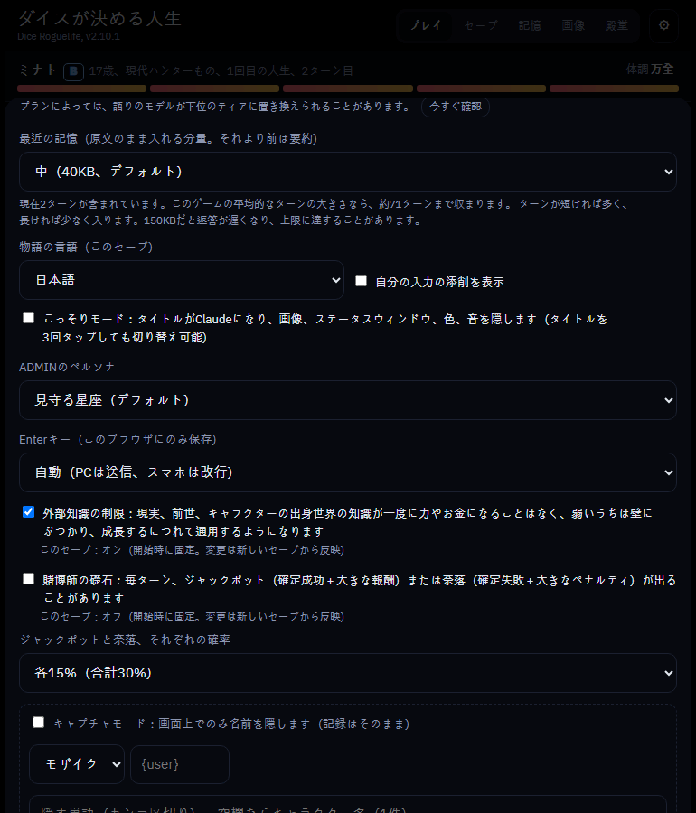
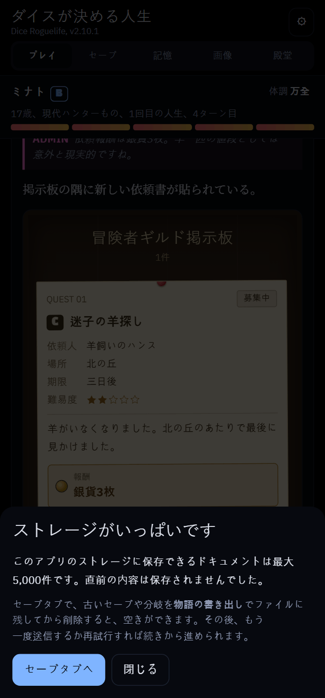

[English](README.md) | [한국어](README.ko.md) | 日本語

# ダイスが決める人生 (Dice Roguelife) - ローグライクAIチャットゲーム

> ## 📖 ガイド
> **日本語: https://wonjoonseol-ws.github.io/dice-roguelife/?lang=ja** · **English: https://wonjoonseol-ws.github.io/dice-roguelife/** · **한국어: https://wonjoonseol-ws.github.io/dice-roguelife/?lang=ko**
> 始め方、ダイスモード、画像の設定をスクリーンショット付きで説明しています。インストールとアップデートの手順はすぐ下にあります。

> ## 🎁 サンプル画像パック（無料素材）
> すぐに使えるサンプルファイルです：**シャドウ画像6枚**とタグファイル（キャラクター3人・画像9枚、背景4枚）。
> **[sample-pack.zip をダウンロード](https://github.com/wonjoonSeol-WS/dice-roguelife/releases/download/free-pack-v1/sample-pack.zip)**
>
> 無料素材はまだ少ないので、**画像の提供を歓迎しています！** [ガイド](https://wonjoonseol-ws.github.io/dice-roguelife/?lang=ja)の「画像の提供を歓迎します」をご覧ください。

ダイスが世界、種族、身分、才能を決め、Claudeがその人生をWeb小説のように語るテキストローグライクです。キャラクターの台詞と
行動を入力すると、結果がどちらにも転びうる場面でd100の判定が振られます。死ぬと回帰し、前世からひとつだけ持ち越して、別の
世界の別の体に生まれ変わります。

画面は English、한국어、日本語 に対応しています。ゲームはブラウザの言語で始まり、**⚙ 設定 → 言語（Language）** で切り替えられます。
物語の言語（英語、韓国語、日本語）はセーブごとに始めたときの言語で続き、入力はどの言語でもかまいません。語りは物語の言語で返ってきます。

- ジャンル世界（ハンター、武林・武侠、ロマンスファンタジー、アポカリプス、塔攻略など）とEXからFまでの等級
- 運：判定ダイス、大成功と大失敗、日々の運、賭博師の礎石
- ニュース、依頼掲示板、コミュニティ掲示板、メッセンジャーのウィジェットと `/コマンド`
- 書き直し、分岐、判定への質問（異議）と訂正
- 画像ライブラリ：キャラクターの立ち絵と背景をアップロードすると、ゲームが場面に表示します
- 人生の決算と殿堂、物語の書き出し（Markdown、HTML）、セーブファイルの書き出しと読み込み

## インストールとアップデート（Claudeアプリで、スマホでもOK）

### 準備（最初に一度だけ）

1. **スマホのブラウザ**（アプリではなく）で [claude.ai 設定 → 機能（Capabilities）](https://claude.ai/settings/capabilities) を開きます。ログインしていない場合は先にログインしてください。
2. **コード実行とファイル作成** をオンにします
3. **ネットワークアクセスを許可（Allow network egress）** をオンにします
   - この項目は**アプリの設定にはありません**。ブラウザでオンにしてください。一度オンにすればアプリにもそのまま反映されます。
   - アカウントによっては初期状態でオフになっています。
4. アプリに戻り、**新しいチャット**を開きます。設定を変える前から開いていたチャットには反映されません。
5. 新しいチャットでもブロックされる場合は、設定の反映に**数分**かかることがあります。5分ほど待ってからもう一度試してください。


### インストール

新しいチャットに次の文をそのまま貼り付けてください。

```
下のリンクから最新の dice-roguelife.html をダウンロードして、私のアーティファクトとして公開してください。
db、sample、user、assets、downloads の機能が必要です。
https://github.com/wonjoonSeol-WS/dice-roguelife/releases/latest/download/dice-roguelife.html
```

公開されたリンクを開けばすぐに遊べます。初めて起動するとき、Claudeが**接続の確認**を求めます。ゲームがClaudeを呼び出して物語を書けるように、**OKをタップ**してください。

### アップデート

セーブデータはアーティファクトのリンクに紐づいています。**新しいアーティファクトを作るとセーブは空から始まる**ので、必ず使っているリンクに上書きしてください。アップデートすると画面が再読み込みされるので、入力中の文は先に送っておきましょう。

ゲーム内の ⚙ 設定 → **アップデートを確認** で、この文を作ってくれます（リンクを貼ると自動で入ります）。自分で書いても構いません。最後の行のリンクだけ、使っているアーティファクトのアドレスに置き換えてください。

```
コンピューターツール（bash）で、下のコマンドを使ってファイルをダウンロードしてください。Web取得（web fetch）は使わないでください。
curl -L -o dice-roguelife.html https://github.com/wonjoonSeol-WS/dice-roguelife/releases/latest/download/dice-roguelife.html
ファイルが数百KBのHTMLファイルであることを確認してから、新しいアーティファクトは作らずに、下の私のアーティファクトのリンクに上書きしてください。
機能は db、sample、user、assets、downloads、artifact にしてください。
私のアーティファクト：（ここに自分のアーティファクトのリンク）
```

### うまくいかないとき

- **「GitHubが自動アクセスをブロックした」と言われたり、ファイルをダウンロードできなかったりした場合**：Web取得でダウンロードしようとしています。次の文を送り直してください。コンピューターツール（bash）でダウンロードさせる文です。

```
コンピューターツール（bash）で、下のコマンドを使ってファイルをダウンロードしてください。Web取得（web fetch）は使わないでください。GitHubにブロックされて失敗します。
curl -L -o dice-roguelife.html https://github.com/wonjoonSeol-WS/dice-roguelife/releases/latest/download/dice-roguelife.html
ファイルが数百KBのHTMLファイル（エラーメッセージではない）であることを確認してから、
db、sample、user、assets、downloads、artifact の機能をオンにして、そのまま私のアーティファクトとして公開してください。
```

- **`403 host_not_allowed` / `Host not in allowlist: github.com`**：ネットワークアクセスがオフになっているか、オンにする前に始めたチャットです。ブラウザで設定を確認し、**新しいチャット**でもう一度試してください。オンにした直後なら反映に数分かかることがあるので、**5分後に再試行**してください。
- **新しいチャットでもブロックされる**：会社や学校のアカウントでは、管理者がネットワークを制限している場合があります。指定したドメインだけを許可する設定なら、`github.com` と `release-assets.githubusercontent.com` を追加してください。
- **それでもうまくいかない**：ブラウザで上のリンクを開いて `dice-roguelife.html` をダウンロードし、チャットにファイルを添付して「このファイルを db、sample、user、assets、downloads の機能をオンにして、私のアーティファクトとして公開してください」と送ってください。

## 動作環境

**claude.ai のアーティファクト専用です。** 普通のWebサイトとして開くとClaudeを呼び出せないため、ゲームは始まりません。ページは
アーティファクトが提供する次の機能を使います。

| 機能 | 用途 |
| --- | --- |
| `db` | セーブ、設定、人生の殿堂、画像リスト（アーティファクトごとのデータベース） |
| `sample` | 語り（Claudeの呼び出し） |
| `user` | プレイヤーごとのセーブの区別 |
| `assets` | 立ち絵と背景の画像ファイル |
| `downloads` | 物語とセーブファイルの書き出し |

**リポジトリに画像素材は含まれていません。** 画像なしでもテキストだけで遊べます。立ち絵と背景はゲームの画像タブで
アーティファクトごとにアップロードします。`female3_smile.png`（セット_表情）や `bg_tavern_night.png` のような名前のファイルは、
種類とセットが自動で分類されます。

## 自分のアーティファクトを公開する（自分でビルドする開発者向け）

1. ページをビルドします。Node.js が必要です（下の「開発」を参照）。
   ```
   npm ci
   npm run build
   ```
   結果は `dist/dice-roguelife.html` の1ファイルです。
2. ファイルを claude.ai のチャットにアップロードし、アーティファクトとして公開するよう Claude に頼みます。上の表の機能
   （`db`、`sample`、`user`、`assets`、`downloads`）が必要だと伝えてください。
3. 公開されたリンクから遊びます。**セーブはそのアーティファクトに紐づいています。** 後で新しいバージョンに移るときは、
   新しいアーティファクトを作らずに同じリンクに上書きしてください。そうしないとセーブは引き継がれません。ゲーム内の
   ⚙ 設定 →「アップデートを確認」で、そのまま貼り付けられる依頼文が手に入ります。

語りのプロンプトはビルド時に `prompts.json` からページに入ります。アーティファクトのデータベースに `config/prompt` という
ドキュメントがあれば、その値が項目ごとに優先されます（[RELEASING.md](RELEASING.md) を参照）。

## コスト：キャラぷなどのチャットサービスとの比較

キャラぷ（Crackの日本版）はチャットのたびにゴールドを使います。このゲームは毎月のClaudeサブスクリプションの範囲内で動きます。

Claudeのプラン（定額）とキャラぷのストーリーモードの1回あたりの料金を比べています。シミュレーション上の数値で、実際とは異なる場合があります。

- キャラぷ：ウルトラチャット（Sonnet 4.6）8G、ハイパーチャット（Opus 4.6）13G、マックスチャット（Fable 5）30G。1G≒1円で計算
  （モデル名はファン運営の「AIと遊ぶWiki」より。アプリ内に表記はありません）
- Claude Pro（月20ドル）：1ドル150円換算で約3,000円

| 月の回数 | ウルトラ | ハイパー | マックス | このゲーム（Claude Pro） |
| ---: | ---: | ---: | ---: | ---: |
| 100（1日3回） | 800円 | 1,300円 | 3,000円 | 3,000円 |
| 230（1日8回） | 1,840円 | 2,990円 | 6,900円 | 3,000円 |
| 380（1日13回） | 3,040円 | 4,940円 | 11,400円 | 3,000円 |
| 600 | 4,800円 | 7,800円 | 18,000円 | 3,000円 |
| 800 | 6,400円 | 10,400円 | 24,000円 | 3,000円 |

- マックスなら月100回、ハイパーなら月230回、ウルトラなら月380回を超えると、このゲームの方が安くなります。
- Proの現実的な目安は**月600〜800回**です。
- もっと遊ぶならMax（月100ドル〜、約15,000円、Proの5倍以上の枠）。設定の「じっくり」でも上限はほとんど気になりません（作者の体感）。
- すでにClaudeを購読しているなら、追加の支払いはありません。
- サブスクリプションには利用上限があります。無制限ではなく、上限はAnthropicが決めます。上位モデルほど早く減ります。

### 物語を多く送ると誰が得をするか

- 1回あたりの料金が固定のサービスは、どれだけ送っても同じ料金なので、送る量を減らすほど儲かります。そのため物語の記憶が
  短くなりがちです。
- このゲームでは、最近の物語をどれだけ送るかを自分で決められます（⚙ 設定、初期値40,000バイト、10,000〜200,000）。
- 多く送るほど、物語をよく覚えています。
- そのぶんサブスクリプションの消費も早くなります。上限によく達するなら減らしてください。



## 設計判断：なぜアーティファクトで配布するのか

**目標：** 開発者でない人でも、サーバーやAPIキー、課金設定なしでアプリを導入し、**自分のアカウントですぐに使える**ようにすること。

### 判断

claude.ai のアーティファクト1つとして配布します。アーティファクトがClaudeの呼び出し（`sample`）、保存（`db`）、画像ファイル
（`assets`）、ユーザーの区別（`user`）を提供し、費用は**各ユーザー自身のClaudeサブスクリプション**から出ます。

### ほかの選択肢との比較

| 選択肢 | 選ばなかった理由 |
| --- | --- |
| APIキー | キーを作って貼り付ける必要があり、呼び出しごとに料金がかかるので支出を予測しにくい。 |
| 運営者のサーバー | サーバーとデータベースを常に動かす必要があり、運営者が全ユーザーの呼び出し料金を払うことになる。 |
| **アーティファクト（採用）** | サーバーもキーも課金設定も不要。運営に費用がかからない。 |

### 得たもの

- リンクを開けば始められ、インストールも設定も不要。
- 運営費がかからないので、長く公開し続けられる。
- 定額なので、毎月の費用が事前にわかる。

### 受け入れたこと

| トレードオフ | 対処法 |
| --- | --- |
| **保存容量に限りがある**（長く遊ぶといっぱいになる） | いっぱいになると新しく保存されません。セーブタブで**古いセーブを書き出してから削除**し、空きを作ってください。 |
| **安全フィルターがAPIより厳しい** | 脱獄的な体験はできません。**成人向けの内容は、キャラぷなどのサービスか、[スタンドアロン版](#オプションスタンドアロン版開発者向け)（ローカルLLMなど）を使ってください。** |
| セーブがアーティファクトに紐づく | アップデートは必ず同じリンクへの上書きで。 |
| 画像はアーティファクトごとに別 | 画像タブでアップロードし直すか、`パックを書き出し`で移してください。 |
| 利用上限はAnthropicが決める | 私には変えられません。最近の物語を送る量を減らすと楽になります。 |
| ひとつのホスト（Claude）に依存する | 下の「拡張性」を参照。 |




### 拡張性

ホスト（ゲームが動く場所）に触れる部分は、すべてひとつのアダプター `src/js/host.js` にまとめてあります。現在**対応しているのは
Claudeだけ**です。別のアダプターを書けば Gemini のようなホストを追加できます。GPTにはアーティファクトのような仕組みがないので、
対応の予定はありません。

## 開発

Node.js 22.13 以降が必要です。開発ツールはすべて `package.json` でバージョンを固定した npm パッケージです。

```
npm ci                             # esbuild、ESLint、Prettier、Playwright（固定バージョン）
npx playwright install chromium    # テスト用ブラウザ、最初に一度

npm run build      # src/ → dist/dice-roguelife.html
npm run lint       # 構文、ESLint、Prettierの書式、コメントに飲み込まれたコード、翻訳
npm run format     # Prettierで整形
npm test           # Playwrightの全テスト（3並列）
npm run release -- 2.5.0   # バージョンを上げて、検査、テスト、パッケージ化
```

- ソースは `src/` にあります。`src/js/` のファイルはESモジュールで、ビルドが `main.js` から esbuild でまとめてページに入れます。
- 画面の文字は英語で書かれ、各言語の `src/locales/<言語>.json` で翻訳されます。[CLAUDE.md](CLAUDE.md)（「Translation」）を参照。
- アーティファクトのランタイム（`window.claude`）を使うのはホストアダプター `src/js/host-claude.js` だけです。別のホストを
  追加するには、`host.js` の約束に従う別のアダプターを書きます。
- バージョンは1か所、`package.json` の `version` にあります。
- テストを1つだけ実行するには `npx playwright test smoke`、ブラウザで見るには `--headed`、失敗を順に追うには
  `npx playwright show-trace` か `--ui` を使います。
- 構造、ターンの流れ、セーブ形式は [ARCHITECTURE.md](ARCHITECTURE.md)、リリース手順は [RELEASING.md](RELEASING.md) を参照してください（どちらも韓国語）。

## オプション：スタンドアロン版（開発者向け）

遊ぶのはアーティファクトが基本です。API キーやローカルモデル（Ollama、LM Studio など）で自分のコンピューターで動かしたい方向けに、
コミュニティが管理するアドオンが [standalone/](standalone/README.md) にあります：[最新リリース](https://github.com/wonjoonSeol-WS/dice-roguelife/releases/latest)から
`dice-roguelife-standalone-v….zip` をダウンロードして展開し、`npm start`（Node.js 22.13 以降、インストール不要）。アーティファクトとは
別ファイルで（アーティファクトのページは `dice-roguelife.html` のまま）、アーティファクトのビルドには含まれません。スマホでも遊びたい場合は、Tailscale で自分のコンピューターに接続できます（その README を参照）。

## ライセンス

[MIT](LICENSE)
