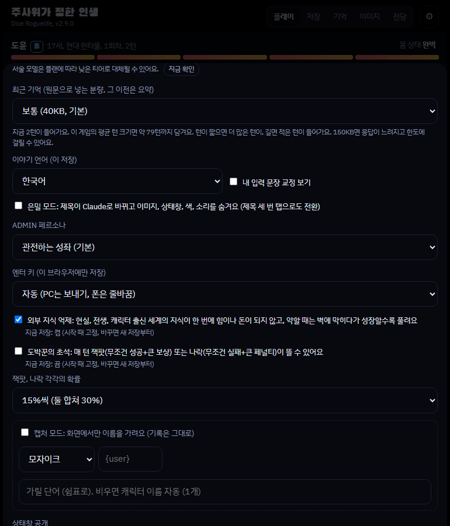
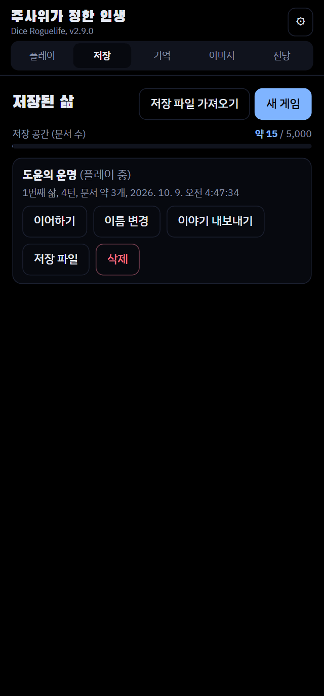
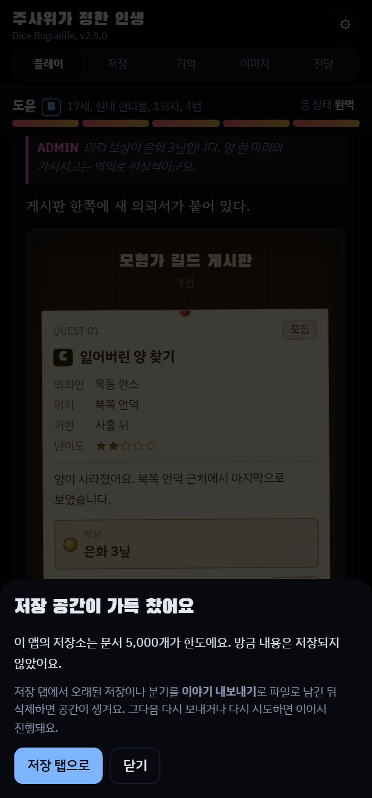

[English](README.md) | 한국어 | [日本語](README.ja.md)

# 주사위가 정한 인생 (Dice Roguelife) - 로그라이크 AI 채팅 게임

> ## 📖 사용법은 가이드 사이트에서 보세요
> **https://wonjoonseol-ws.github.io/dice-roguelife/?lang=ko** (English: https://wonjoonseol-ws.github.io/dice-roguelife/ · 日本語: https://wonjoonseol-ws.github.io/dice-roguelife/?lang=ja)
> 화면 캡처와 함께 시작하는 법, 주사위 모드, 이미지 설정 방법을 설명해요. 설치와 업데이트 방법은 바로 아래에 있어요.

> ## 🎁 샘플 이미지 팩 (무료 에셋)
> 바로 쓸 수 있는 예제 파일이에요. **그림자 이미지 6장**과 태그 파일(캐릭터 3명 9장, 배경 4장)이 들어 있어요.
> **[sample-pack.zip 받기](https://github.com/wonjoonSeol-WS/dice-roguelife/releases/download/free-pack-v1/sample-pack.zip)**
>
> 무료 에셋이라 수가 많지 않아요. **이미지 기여는 환영합니다!** 방법은 [가이드 사이트](https://wonjoonseol-ws.github.io/dice-roguelife/?lang=ko)의 "이미지 기여 환영"을 봐 주세요.

세계, 종족, 신분, 재능을 주사위가 정하고, Claude가 웹소설 문체로 그 삶을 서술하는 텍스트 로그라이크입니다. 화면은
한국어, 영어, 일본어를 지원하고(브라우저 언어로 시작, ⚙ → 화면 언어에서 변경), 이야기 언어는 저장마다 시작할 때의
언어로 이어지고, 입력은 아무 언어로 해도 서술은 이야기 언어로 나와요.
플레이어는 대사와 행동을 입력하고, 결과가 갈리는 순간에는 d100 판정이 굴러갑니다. 죽으면 회귀해서 다른 세계의 다른
몸으로 다시 태어나고, 지난 삶에서 하나를 물려받습니다.

- 헌터물, 무협, 로판, 아포칼립스, 탑 등반 등 장르별 세계와 등급(EX부터 F까지)
- 판정 주사위, 대성공과 대실패, 생활 운, 도박꾼의 초석 같은 운 요소
- 뉴스, 의뢰 게시판, 커뮤니티, 메신저 위젯과 `/명령어`
- 다시 쓰기, 분기, 판정 질문(이의 제기)과 정정
- 캐릭터 초상화와 배경을 직접 올려 장면에 붙이는 이미지 라이브러리
- 인생 결산과 전당, 이야기 내보내기(Markdown, HTML), 저장 파일 내보내기와 가져오기

## 설치와 업데이트 (Claude 앱에서, 폰도 가능)

### 준비 (처음 한 번만)

1. **폰 브라우저**(앱 말고)로 [claude.ai 설정 → 기능(Capabilities)](https://claude.ai/settings/capabilities)을 열어요. 로그인이 안 되어 있으면 먼저 로그인하세요.
2. **코드 실행 및 파일 생성** 켜기
3. **네트워크 허용(Allow network egress)** 켜기
   - 이 항목은 **앱 설정에는 없어요.** 브라우저에서 켜야 해요. 한 번 켜면 앱에도 그대로 적용돼요.
   - 계정에 따라 기본으로 꺼져 있어요.
4. 앱으로 돌아와 **새 대화**를 열어서 진행하세요. 이미 열려 있던 대화에는 바뀐 설정이 적용되지 않아요.
5. 새 대화에서도 막히면 **설정이 반영되기까지 몇 분** 걸릴 수 있어요. 5분쯤 뒤에 다시 시도하세요.


### 설치

새 대화에 아래 문구를 그대로 붙여 넣으세요.

```
아래 링크의 최신 버전 dice-roguelife.html 파일을 받아서, 내 아티팩트로 게시해 줘.
db, sample, user, assets, downloads 기능이 모두 필요해.
https://github.com/wonjoonSeol-WS/dice-roguelife/releases/latest/download/dice-roguelife.html
```

게시된 링크를 열면 바로 플레이할 수 있어요. 처음 실행할 때 **Claude 연결 확인 창**이 떠요. **확인(OK)을 눌러야** 게임이 Claude를 불러 이야기를 쓸 수 있어요.

### 업데이트

저장 데이터는 아티팩트 링크에 묶여 있어요. **새 아티팩트를 만들면 저장이 빈 채로 시작**하니, 꼭 쓰던 링크에 덮어쓰세요. 업데이트하면 화면이 새로고침되니 쓰던 입력은 먼저 보내 두세요.

게임 안 ⚙ 설정 → **업데이트 확인**에서 아래 문구를 만들어 줘요(링크를 넣으면 자동으로 채워져요). 직접 쓰셔도 돼요. 맨 아래 줄의 링크만 쓰던 아티팩트 주소로 바꿔 주세요.

```
컴퓨터 도구(bash)에서 아래 명령으로 파일을 받아 줘. 웹 읽기(web fetch)는 쓰지 마.
curl -L -o dice-roguelife.html https://github.com/wonjoonSeol-WS/dice-roguelife/releases/latest/download/dice-roguelife.html
받은 파일이 수백 KB짜리 HTML인지 확인한 다음, 새 아티팩트를 만들지 말고 아래 내 아티팩트 링크에 덮어써 줘.
기능은 db, sample, user, assets, downloads, artifact로 맞춰 줘.
내 아티팩트: (여기에 내 아티팩트 링크)
```

### 막혔을 때

- **"GitHub가 자동 접근을 막았다"고 하거나 파일을 받지 못했다고 하면**: 웹 읽기로 받으려 한 거예요. 아래 문구로 다시 보내세요. 컴퓨터 도구(bash)로 받게 하는 문구예요.

```
컴퓨터 도구(bash)에서 아래 명령으로 파일을 받아 줘. 웹 읽기(web fetch)는 쓰지 마. GitHub가 막아서 실패해.
curl -L -o dice-roguelife.html https://github.com/wonjoonSeol-WS/dice-roguelife/releases/latest/download/dice-roguelife.html
받은 파일이 수백 KB짜리 HTML인지(오류 문구가 아닌지) 확인한 다음,
db, sample, user, assets, downloads, artifact 기능을 켜서 그대로 내 아티팩트로 게시해 줘.
```

- **`403 host_not_allowed` / `Host not in allowlist: github.com`**: 네트워크 허용이 꺼져 있거나, 켜기 전에 시작한 대화예요. 브라우저에서 설정을 확인하고 **새 대화**에서 다시 해 보세요. 켠 직후라면 반영에 몇 분 걸릴 수 있으니 **5분 뒤 재시도**해 보세요.
- **새 대화에서도 막힘**: 회사나 학교 계정이면 관리자가 네트워크를 막아 뒀을 수 있어요. 직접 고른 도메인만 허용하는 설정이라면 `github.com`과 `release-assets.githubusercontent.com`을 추가해 주세요.
- **그래도 안 되면**: 브라우저로 위 링크를 열어 `dice-roguelife.html`을 받은 뒤, 채팅에 파일을 첨부하고 "이 파일을 db, sample, user, assets, downloads 기능을 켜서 내 아티팩트로 게시해 줘"라고 보내세요.

## 실행 환경

**claude.ai 아티팩트 전용입니다.** 일반 웹사이트로 열면 Claude를 호출할 수 없어서 게임이 시작되지 않습니다. 페이지는
아티팩트가 제공하는 다음 기능을 씁니다.

| 기능 | 쓰는 곳 |
| --- | --- |
| `db` | 저장, 설정, 전당, 이미지 목록 (아티팩트마다 따로 있는 데이터베이스) |
| `sample` | 서술(Claude 호출) |
| `user` | 플레이어별 저장 공간 구분 |
| `assets` | 초상화와 배경 이미지 파일 |
| `downloads` | 이야기와 저장 파일 내보내기 |

**이미지 에셋은 저장소에 들어 있지 않습니다.** 이미지 없이도 텍스트로 플레이할 수 있고, 초상화와 배경은 게임 안의
이미지 탭에서 아티팩트마다 직접 올립니다. 파일 이름이 `female3_smile.png`(세트_표정)나 `bg_tavern_night.png` 꼴이면
종류와 세트를 알아서 분류합니다.

## 내 아티팩트로 띄우기 (직접 빌드하는 개발자용)

1. 페이지를 빌드합니다. Node.js가 필요합니다(아래 "개발").
   ```
   npm ci
   npm run build
   ```
   결과는 `dist/dice-roguelife.html` 한 파일입니다.
2. claude.ai 대화에 이 파일을 올리고, 아티팩트로 게시해 달라고 요청합니다. 위 표의 기능(`db`, `sample`, `user`,
   `assets`, `downloads`)이 필요하다고 함께 알려 주세요.
3. 게시된 링크에서 플레이합니다. **저장 데이터는 그 아티팩트에 묶여 있습니다.** 나중에 새 버전으로 바꿀 때도 새
   아티팩트를 만들지 말고 같은 링크에 덮어써야 저장이 유지됩니다. 게임 안의 ⚙ 설정에서 "업데이트 확인"을 누르면 그대로
   붙여 넣을 수 있는 요청 문구가 나옵니다.

서술 프롬프트는 빌드할 때 `prompts.json`에서 페이지 안에 들어갑니다. 아티팩트 데이터베이스의 `config/prompt` 문서가
있으면 그 값이 항목별로 우선합니다(자세한 내용은 [RELEASING.md](RELEASING.md)).

## 비용: 크랙 같은 챗 서비스와 비교

크랙은 미리 충전해 두고 호출할 때마다 돈이 빠지는 충전제이고, 이 게임은 매달 내는 Claude 구독 안에서 돌아가요.

Claude 20달러 요금제(정액)와 크랙 호출당 과금(충전제)을 비교했어요. 아래는 시뮬레이션 값이라 실제와 다를 수 있어요.

- 크랙: Sonnet 기준 한 번 호출에 61원
- Claude 20달러 요금제: 환율을 1달러에 1,400원으로 잡아 약 28,000원

| 한 달 호출 수 | 크랙 (충전제, 한 번에 61원) | 이 게임 (Claude 20달러 요금제) |
| ---: | ---: | ---: |
| 100번 | 6,100원 | 28,000원 |
| 300번 | 18,300원 | 28,000원 |
| **약 460번 (하루 15번)** | **28,060원** | **28,000원** |
| 600번 | 36,600원 | 28,000원 |
| 800번 | 48,800원 | 28,000원 |
| 1,000번* | 61,000원 | 28,000원* |
| 1,500번* | 91,500원 | 28,000원* |

- 한 달에 460번 넘게 하면 이 게임이 더 싸요.
- 현실적인 기준은 **한 달 800번** 정도예요. 이때 크랙은 48,800원, 이 게임은 28,000원이에요.
- 이미 Claude를 구독 중이라면 따로 내는 돈은 없어요.
- 구독에는 사용량 한도가 있어요. 무제한은 아니고, 한도는 Anthropic이 정해요.

\* 1,000번과 1,500번은 값을 비교하려고 넣은 참고 숫자예요. Claude 20달러 요금제로 한 달에 이만큼 쓰기는 현실적으로 어려워서, 더 쓰려면 더 비싼 요금제가 필요할 수 있어요.

### 대화를 많이 보내면 누가 이득일까

- 호출당 가격이 정해진 서비스는 한 번에 얼마를 보내든 값이 같아요. 그래서 서비스 입장에서는 보내는 양을 줄일수록 남아요. 이야기 기억이 짧아지기 쉬운 이유예요.
- 이 게임은 최근 대화를 얼마나 보낼지 직접 정해요. (⚙ 설정, 기본 40,000바이트, 10,000~200,000)
- 많이 보낼수록 이야기를 더 잘 기억해요.
- 대신 구독 사용량도 빨리 줄어요. 한도에 자주 걸리면 양을 줄여 보세요.



## 설계 결정: 왜 아티팩트로 배포하나요

**목표:** 개발자가 아닌 사람도 서버, API 키, 결제 설정 없이 앱을 배포하고, **자기 계정으로 바로 쓸 수 있게 하는 것**이에요.

### 결정

claude.ai 아티팩트 하나로 배포해요. Claude 호출(`sample`), 저장(`db`), 이미지 파일(`assets`), 사용자 구분(`user`)은 아티팩트가 제공하고, 비용은 **사용자 본인의 Claude 구독**에서 나가요.

### 다른 방법과 비교

| 방법 | 선택하지 않은 이유 |
| --- | --- |
| API 키 방식 | 키를 발급해서 붙여 넣어야 하고, 호출마다 돈이 나가서 얼마나 쓸지 가늠하기 어려워요. |
| 운영자 서버 | 서버와 DB를 계속 운영해야 하고, 모든 사용자의 호출 비용을 운영자가 내야 해요. |
| **아티팩트 (선택)** | 서버도 키도 결제 설정도 없어요. 운영 비용이 들지 않아요. |

### 얻은 것

- 설치나 설정 없이 링크만 열면 바로 시작해요.
- 운영 비용이 없어서 오래 유지할 수 있어요.
- 정액제라 한 달 요금을 미리 알 수 있어요.

### 감수한 것

| 감수한 것 | 대처 방법 |
| --- | --- |
| **저장 용량 제한** (오래 플레이해서 저장이 쌓이면 가득 차요) | 가득 차면 새 내용이 저장되지 않아요. 저장 탭에서 오래된 저장을 **내보낸 뒤 삭제**하면 다시 늘어나요. |
| **안전 필터가 API보다 엄격해요** | 탈옥 같은 경험은 할 수 없어요. **성인 콘텐츠는 크랙 같은 서비스나, 로컬 모델을 쓰는 [독립 실행판](#선택-독립-실행판-개발자용)을 써 주세요.** |
| 저장이 아티팩트에 묶여요 | 업데이트는 항상 같은 링크에 덮어써요. |
| 이미지가 아티팩트마다 따로 있어요 | 이미지 탭에서 다시 올리거나 `팩 내보내기`로 옮겨요. |
| 사용량 한도를 Anthropic이 정해요 | 제가 바꿀 수는 없어요. 최근 대화 분량을 줄이면 덜 걸려요. |
| 한 곳(Claude)에 기대고 있어요 | 아래 확장성을 봐 주세요. |




### 확장성

호스트(실행되는 곳)와 닿는 부분은 `src/js/host.js`의 어댑터 한 곳에 모아 뒀어요. 지금은 **Claude만 지원**하고, 어댑터를 하나 더 만들면 Gemini 같은 다른 곳도 붙일 수 있어요. GPT는 아티팩트 같은 기능이 없어서 지원할 계획이 없어요.

## 개발

필요한 것: Node.js 22.13 이상. 개발 도구는 모두 `package.json`에 고정된 npm 패키지입니다.

```
npm ci                             # esbuild, ESLint, Prettier, Playwright (고정 버전)
npx playwright install chromium    # 테스트용 브라우저, 처음 한 번

npm run build      # src/ → dist/dice-roguelife.html
npm run lint       # 문법, ESLint, Prettier 형식, 주석에 삼켜진 코드, 번역 검사
npm run format     # Prettier로 정렬
npm test           # Playwright 테스트 전체 (3개 병렬)
npm run release -- 2.2.0   # 버전 올리기, 검사, 테스트, 패키지
```

- 소스는 `src/`에 있습니다. `src/js/`의 파일은 ES 모듈이고, 빌드가 esbuild로 `main.js`부터 묶어 페이지에 넣습니다.
- 화면 문구는 영어로 쓰고 `src/locales/ko.json`으로 한국어를 붙입니다. 자세한 규칙은 [CLAUDE.md](CLAUDE.md)의 "Translation"을 보세요.
- 아티팩트 런타임(`window.claude`)은 호스트 어댑터 `src/js/host-claude.js`만 씁니다. 다른 호스트를 붙이려면 `host.js`의
  계약대로 어댑터를 하나 더 만들면 됩니다.
- 버전은 `package.json`의 `version` 한 곳에만 있습니다.
- 테스트 하나만 돌릴 땐 `npx playwright test smoke`, 브라우저를 띄워 보려면 `--headed`, 실패한 테스트를 단계별로 보려면
  `npx playwright show-trace`나 `--ui`를 씁니다.
- 구조와 턴 흐름, 저장 형식은 [ARCHITECTURE.md](ARCHITECTURE.md), 배포 절차는 [RELEASING.md](RELEASING.md)를
  보세요.

## 선택: 독립 실행판 (개발자용)

플레이는 아티팩트로 하는 게 기본이에요. API 키나 로컬 모델(Ollama, LM Studio 등)로 내 컴퓨터에서 돌리고 싶은 분을 위해
커뮤니티가 관리하는 애드온이 [standalone/](standalone/README.md)에 있어요: [최신 릴리스](https://github.com/wonjoonSeol-WS/dice-roguelife/releases/latest)에서
`dice-roguelife-standalone-v….zip`을 받아 압축을 풀고 `npm start`(Node.js 22.13 이상, 따로 설치할 것 없음). 아티팩트와는
별도 파일이고(아티팩트 페이지는 그대로 `dice-roguelife.html`), 아티팩트 빌드에는 들어가지 않아요. 폰에서도 하고 싶다면 Tailscale로 내 컴퓨터에 접속하면 돼요(그 README 참고).

## 라이선스

[MIT](LICENSE)
