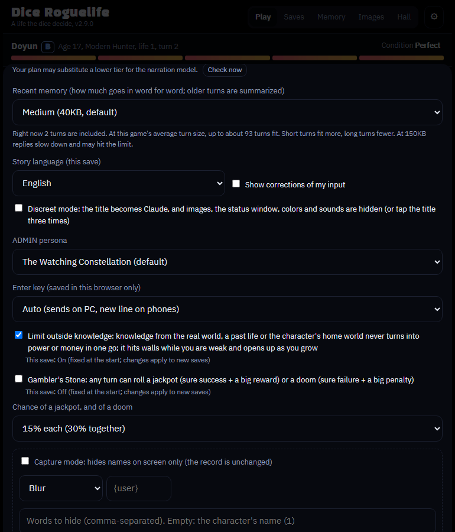
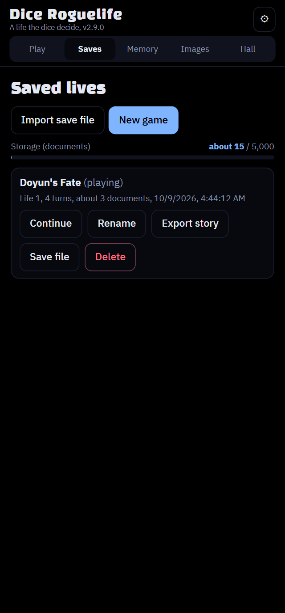
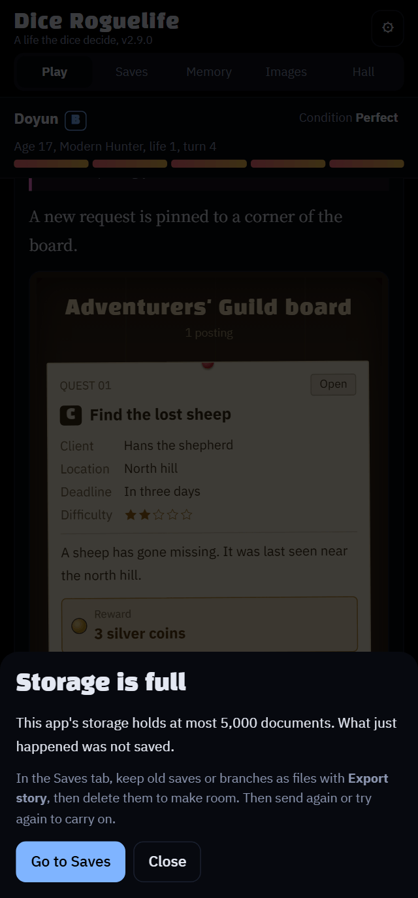

English | [한국어](README.ko.md) | [日本語](README.ja.md)

# Dice Roguelife - a roguelike AI chat game

> ## 📖 The guide
> **English: https://wonjoonseol-ws.github.io/dice-roguelife/** · **한국어: https://wonjoonseol-ws.github.io/dice-roguelife/?lang=ko** · **日本語: https://wonjoonseol-ws.github.io/dice-roguelife/?lang=ja**
> How to start, the dice modes and setting up images, with screenshots. Install and update steps are right below.

> ## 🎁 Sample image pack (free assets)
> Ready-to-use example files: **6 shadow images** and a tag file (3 characters with 9 images, 4 backgrounds).
> **[Download sample-pack.zip](https://github.com/wonjoonSeol-WS/dice-roguelife/releases/download/free-pack-v1/sample-pack.zip)**
>
> Free assets are few, so **image contributions are welcome!** See "Image contributions welcome" on the [guide](https://wonjoonseol-ws.github.io/dice-roguelife/).

A text roguelike where the dice decide your world, race, standing and talent, and Claude narrates that life in the style
of a web novel. You type your character's lines and actions, and a d100 check rolls whenever the outcome could go either
way. When you die, you regress and are reborn in a different body in a different world, carrying one thing from the life
before.

The screen comes in English, Korean and Japanese: the game starts in your browser's language, and you can switch in
**⚙ Settings → Language**. Each save keeps the story language it began in (English, Korean or Japanese), and you can type in any
language: the narrator answers in the story language.

- Genre worlds (hunter, murim martial arts, romance fantasy, apocalypse, tower climbing and more) and grades from EX to F
- Luck: check dice, critical successes and failures, daily luck, the Gambler's Stone
- News, quest board, community board and messenger widgets, and `/commands`
- Rewrites, branches, check questions (objections) and corrections
- An image library: upload character portraits and backgrounds and the game puts them in scenes
- Life Reviews and the Hall, story export (Markdown, HTML), save file export and import

## Install and update (in the Claude app, phones too)

### Before you start (once)

1. In your **phone's browser** (not the app), open [claude.ai Settings → Capabilities](https://claude.ai/settings/capabilities). Sign in first if you aren't.
2. Turn on **Code execution and file creation**
3. Turn on **Allow network egress**
   - This option **isn't in the app's settings**; turn it on in a browser. Once it's on, it applies to the app too.
   - Some accounts have it off by default.
4. Go back to the app and start a **new chat**. Chats that were already open don't pick up the new setting.
5. If a new chat is still blocked, the setting can take **a few minutes** to apply. Try again in about 5 minutes.


### Install

Paste this into a new chat as is.

```
Download the latest dice-roguelife.html from the link below and publish it as my artifact.
It needs the db, sample, user, assets and downloads capabilities.
https://github.com/wonjoonSeol-WS/dice-roguelife/releases/latest/download/dice-roguelife.html
```

Open the published link and play. The first time it runs, Claude asks you to **confirm the connection**. **Tap OK** so the game can call Claude to write the story.

### Update

Your saves are tied to the artifact link. **A new artifact starts with no saves**, so always overwrite the link you've been using. Updating reloads the page, so send anything you were typing first.

In the game, ⚙ Settings → **Check for updates** writes this prompt for you (paste your link and it fills itself in). You can also write it yourself; just replace the link on the last line with your artifact's address.

```
Use the computer tool (bash) to download the file with the command below. Don't use web fetch.
curl -L -o dice-roguelife.html https://github.com/wonjoonSeol-WS/dice-roguelife/releases/latest/download/dice-roguelife.html
Check that the file is an HTML file of a few hundred KB, then overwrite my artifact at the link below instead of creating a new one.
Set its capabilities to db, sample, user, assets, downloads and artifact.
My artifact: (paste your artifact link here)
```

### If you get stuck

- **Claude says "GitHub blocked automated access" or couldn't download the file**: it tried web fetch. Send the prompt below instead; it makes Claude download the file with the computer tool (bash).

```
Use the computer tool (bash) to download the file with the command below. Don't use web fetch; GitHub blocks it.
curl -L -o dice-roguelife.html https://github.com/wonjoonSeol-WS/dice-roguelife/releases/latest/download/dice-roguelife.html
Check that the file is an HTML file of a few hundred KB (not an error message),
then publish it as my artifact with the db, sample, user, assets, downloads and artifact capabilities turned on.
```

- **`403 host_not_allowed` / `Host not in allowlist: github.com`**: network egress is off, or the chat was started before you turned it on. Check the setting in a browser and try again in a **new chat**. If you just turned it on, it can take a few minutes: **try again in 5 minutes**.
- **Still blocked in a new chat**: on a work or school account, an admin may have restricted network access. If the setting only allows chosen domains, add `github.com` and `release-assets.githubusercontent.com`.
- **Still not working**: download `dice-roguelife.html` from the link above in a browser, attach it to the chat, and send "Publish this file as my artifact with the db, sample, user, assets and downloads capabilities turned on."

## Where it runs

**Only as a claude.ai artifact.** Opened as a normal website, it can't call Claude and the game won't start. The page uses
these capabilities the artifact provides:

| Capability | Used for |
| --- | --- |
| `db` | Saves, settings, the Hall, the image list (a database for each artifact) |
| `sample` | Narration (calling Claude) |
| `user` | Keeping each player's saves apart |
| `assets` | Portrait and background image files |
| `downloads` | Exporting stories and save files |

**The repository has no image assets.** You can play text-only without images; portraits and backgrounds are uploaded per
artifact in the game's Images tab. Files named like `female3_smile.png` (set_emotion) or `bg_tavern_night.png` are sorted
into their kind and set automatically.

## Publishing your own artifact (for developers building it yourself)

1. Build the page. You need Node.js (see "Development" below).
   ```
   npm ci
   npm run build
   ```
   The result is one file, `dist/dice-roguelife.html`.
2. Upload the file to a claude.ai chat and ask Claude to publish it as an artifact. Mention that it needs the capabilities
   in the table above (`db`, `sample`, `user`, `assets`, `downloads`).
3. Play from the published link. **Saves are tied to that artifact.** When you move to a new version later, overwrite the
   same link instead of creating a new artifact, or the saves won't carry over. ⚙ Settings → "Check for updates" in the
   game gives you a request you can paste as is.

The narration prompt goes into the page from `prompts.json` at build time. If the artifact database has a
`config/prompt` document, its values take precedence field by field (see [RELEASING.md](RELEASING.md)).

## Cost: compared with chat services like Crack

Crack (a Korean AI chat service) is prepaid: you top up and each call costs money. This game runs inside your monthly
Claude subscription.

Comparing Claude's $20 plan (flat) with Crack's pay-per-call. These are simulated figures and may differ in practice.

- Crack: 61 KRW per call with Sonnet
- Claude $20 plan: about 28,000 KRW at 1,400 KRW to the dollar

| Calls per month | Crack (prepaid, 61 KRW a call) | This game (Claude $20 plan) |
| ---: | ---: | ---: |
| 100 | 6,100 KRW | 28,000 KRW |
| 300 | 18,300 KRW | 28,000 KRW |
| **about 460 (15 a day)** | **28,060 KRW** | **28,000 KRW** |
| 600 | 36,600 KRW | 28,000 KRW |
| 800 | 48,800 KRW | 28,000 KRW |
| 1,000* | 61,000 KRW | 28,000 KRW* |
| 1,500* | 91,500 KRW | 28,000 KRW* |

- Past 460 calls a month, this game is cheaper.
- A realistic figure is **about 800 a month**: 48,800 KRW on Crack, 28,000 KRW here.
- If you already subscribe to Claude, there's nothing extra to pay.
- Subscriptions have usage limits. It isn't unlimited, and Anthropic sets the limits.

\* 1,000 and 1,500 are reference numbers for comparing prices. Using that much in a month on the $20 plan is hard in
practice; you may need a pricier plan to use more.

### Who gains when you send more of the story

- A service with a fixed price per call charges the same however much you send, so it profits by sending less. That's why
  story memory tends to get short.
- This game lets you decide how much of the recent story to send (⚙ Settings, default 40,000 bytes, 10,000 to 200,000).
- The more you send, the better it remembers the story.
- It also uses up your subscription faster. If you hit the limit often, lower it.



## Design decision: why ship as an artifact

**Goal:** let people who aren't developers deploy the app without servers, API keys or billing setup, and **use it right
away on their own account**.

### Decision

Ship it as a single claude.ai artifact. The artifact provides Claude calls (`sample`), storage (`db`), image files
(`assets`) and telling users apart (`user`), and the cost comes out of **each user's own Claude subscription**.

### Compared with other options

| Option | Why not |
| --- | --- |
| API keys | You have to create and paste a key, and every call costs money, so spending is hard to predict. |
| Operator's server | The server and database need constant running, and the operator pays for every user's calls. |
| **Artifact (chosen)** | No server, no keys, no billing setup. Nothing to pay to run it. |

### What we gained

- Open the link and start; no install or setup.
- No running costs, so it can stay up for a long time.
- A flat rate, so you know the monthly cost in advance.

### What we accepted

| Trade-off | How to deal with it |
| --- | --- |
| **Limited storage** (it fills up after long play) | When full, nothing new is saved. In the Saves tab, **export old saves, then delete them** to free space. |
| **Safety filters are stricter than the API's** | Jailbreak-style experiences aren't possible. **For adult content, use services like Crack, or the [standalone](#optional-standalone-for-developers) with a local model.** |
| Saves are tied to the artifact | Always update by overwriting the same link. |
| Images are separate for each artifact | Upload them again in the Images tab, or move them with `Export pack`. |
| Anthropic sets the usage limits | I can't change them. Sending less recent story helps. |
| It depends on one host (Claude) | See Extensibility below. |




### Extensibility

Everything that touches the host (where the game runs) is gathered in one adapter, `src/js/host.js`. Today **only Claude
is supported**; another adapter could add a host like Gemini. GPT has nothing like artifacts, so there are no plans for it.

## Development

You need Node.js 22.13 or later. The dev tools are all npm packages pinned in `package.json`.

```
npm ci                             # esbuild, ESLint, Prettier, Playwright (pinned versions)
npx playwright install chromium    # the test browser, once

npm run build      # src/ → dist/dice-roguelife.html
npm run lint       # syntax, ESLint, Prettier format, code swallowed by comments, translations
npm run format     # format with Prettier
npm test           # all Playwright tests (3 in parallel)
npm run release -- 2.5.0   # bump the version, check, test, package
```

- The source is in `src/`. Files in `src/js/` are ES modules; the build bundles them from `main.js` with esbuild into the
  page.
- Screen text is written in English and translated through `src/locales/ko.json`; see [CLAUDE.md](CLAUDE.md)
  ("Translation").
- Only the host adapter `src/js/host-claude.js` uses the artifact runtime (`window.claude`). To add another host, write
  another adapter that follows the contract in `host.js`.
- The version lives in one place: `version` in `package.json`.
- Run one test with `npx playwright test smoke`, watch it in a browser with `--headed`, and step through a failure with
  `npx playwright show-trace` or `--ui`.
- See [ARCHITECTURE.md](ARCHITECTURE.md) for the structure, the turn flow and the save format, and
  [RELEASING.md](RELEASING.md) for the release steps (both in Korean).

## Optional: standalone (for developers)

The artifact is the way to play. For people who would rather run the game on their own computer with an API key or a
local model (Ollama, LM Studio and others), there is a community-maintained add-on in [standalone/](standalone/README.md):
download `dice-roguelife-standalone-v….zip` from the [latest release](https://github.com/wonjoonSeol-WS/dice-roguelife/releases/latest), unzip it and run `npm start` (Node.js
22.13 or later, nothing to install). It is a separate download: the artifact page is still `dice-roguelife.html`, and
the artifact build doesn't include the add-on. To play on your phone as well, reach your computer through Tailscale
(see that README).

## License

[MIT](LICENSE)
